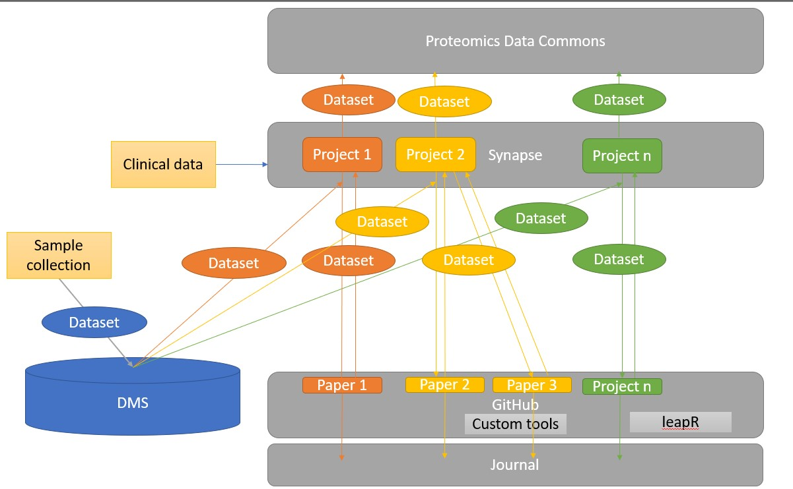

# The PNNL Proteomics Pipeline: P3
This project provides the basic analysis and tools for carrying out end-to-end proteomic analysis for data generated at PNNL. This repository will serve as a resource upon which we can build additional tools in a reusable fashion.

## Overview

### To contribute to this pipeline
Check out the [CONTRIBUTING.md](./CONTRIBUTING.md) document. We welcome all additional tool and methods. Then you can create a pull request and merge your code in.

### To use this pipeline
Click on the `Use this template` button above. This will allow you to create your own repository. 

## Pipeline overview
This pipeline links together a series of data and code repositories to ensure that any data is saved for future use. Furthermore we hope to be able to reproduce the analysis for future projects. A brief overview of each tool is described here.

### Proteomics and phosphoproteomics processing
This processing relies on a series of customized `R` scripts that are in the following directories:
- [global](./global): global proteomics analysis documentation is [here](./global/README.md)
- [phospo](./phospho): phosphoproteomics analysis documentation is [here](./global/README.md)
Once this analysis is complete, the data should be stored on Synapse

### Synapse processing
Synapse is used for:
- data storage: data is backed up for free
- data processing: UUIDs and permission modifications allow for easy analysis
- data release: data can be moved to the PDC or shared

You will need to acquire a [synapse username](http://synapse.org/register) to access synapse, and become a [certified user]() to add data, but after that you will be set with future projects. 

### Functional analysis
There are typically a few steps we do for functional analysis. They are described in the [functional analysis](./functional) directory for now. 
